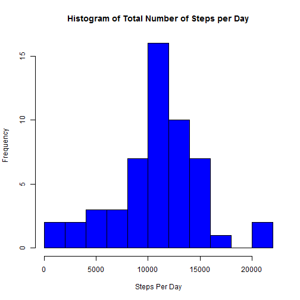

This assignment makes use of data from a personal activity monitoring device. This device collects data at 5 minute intervals through out the day. The data consists of two months of data from an anonymous individual collected during the months of October and November, 2012 and include the number of steps taken in 5 minute intervals each day.

####Load the Knitr Package and Set Global Options

```r
library(knitr)
```


```r
opts_chunk$set(echo=TRUE)
```

####Load Package Requirements

```r
library(dplyr)
```

```
## 
## Attaching package: 'dplyr'
## 
## The following objects are masked from 'package:stats':
## 
##     filter, lag
## 
## The following objects are masked from 'package:base':
## 
##     intersect, setdiff, setequal, union
```

```r
library(ggplot2)
```

####Loading & Preprocessing the Data


```r
activityData <- read.csv('./data/activity.csv', sep=',', header=TRUE)
activityData$date <- as.Date(activityData$date)  #change to date format
```

### (1) Mean Total Number of Steps Taken Per Day

####Calculate the total number of steps per day.

```r
# Group, filter, calculate mean and summarise (using chaining)
stepsPerDay <- group_by(activityData, date) %>%
      filter(!is.na(steps)) %>%
      summarize(stepSum=sum(steps)) %>%
      print
```

```
## Source: local data frame [53 x 2]
## 
##          date stepSum
## 1  2012-10-02     126
## 2  2012-10-03   11352
## 3  2012-10-04   12116
## 4  2012-10-05   13294
## 5  2012-10-06   15420
## 6  2012-10-07   11015
## 7  2012-10-09   12811
## 8  2012-10-10    9900
## 9  2012-10-11   10304
## 10 2012-10-12   17382
## ..        ...     ...
```

####Make a histogram of the total number of steps taken per day.

```r
hist(stepsPerDay$stepSum, breaks=10, col='blue', xlab='Steps Per Day', main='Histogram of Total Number of Steps per Day')
```

 

####Calculate & report the mean and median of the total number of steps taken per day.

```r
median(stepsPerDay$stepSum)
```

```
## [1] 10765
```

```r
mean(stepsPerDay$stepSum)
```

```
## [1] 10766.19
```

###(2) Average Daily Activity Pattern

#### Time series plot of the 5 minute interval & the average number of steps taken, averaged across all days (y-axis).


```r
# Group, filter, calculate mean and summarise dataset
stepsPerInterval <- group_by(activityData, interval) %>%
      filter(!is.na(steps)) %>%
      summarize(Steps=mean(steps)) %>%
      print
```

```
## Source: local data frame [288 x 2]
## 
##    interval     Steps
## 1         0 1.7169811
## 2         5 0.3396226
## 3        10 0.1320755
## 4        15 0.1509434
## 5        20 0.0754717
## 6        25 2.0943396
## 7        30 0.5283019
## 8        35 0.8679245
## 9        40 0.0000000
## 10       45 1.4716981
## ..      ...       ...
```
**Time Series plot**

```r
plot(stepsPerInterval$interval, main='Average Daily Activity Pattern',stepsPerInterval$Steps, typ='l',
     xlab='5-Minute Interval', ylab='Average Number of Steps')
```

 

####Which 5 Minute interval, on average across all the days in the dataset, contains the max number of steps?

```r
stepsPerInterval[stepsPerInterval$Steps == (max(stepsPerInterval$Steps)),]
```

```
## Source: local data frame [1 x 2]
## 
##   interval    Steps
## 1      835 206.1698
```

### (4) Imputting Missing values

####Calculate & report the total number of missing values in the dataset.

```r
sum(rowSums(is.na(activityData)))
```

```
## [1] 2304
```

####Devise a strategy for filling in all missing values in the dataset and create a new dataset that is equal to the original dataset but with the missing data filled in.

**Strategy:**
Fill in missing values with the mean for that 5-minute interval and create a new dataset.

```r
naData <- is.na(activityData$steps)
meanInterval <- tapply(activityData$steps, activityData$interval, mean, na.rm=TRUE)
newDataset <- activityData
newDataset$steps[naData] <- meanInterval[as.character(newDataset$interval[naData])]
```
**Check for missing values**

```r
any(is.na(newDataset$steps))
```

```
## [1] FALSE
```

#### Histogram of total number of steps taken each day. 

```r
perDay <- tapply(newDataset$steps, newDataset$date, sum)
hist(perDay, col='blue', xlab='Steps Per Day', breaks=10, main='Histogram: Total Number of Steps per day without NAs')
```

 

#### Calculate & report the mean & median total number of steps per day.

```r
median(perDay)
```

```
## [1] 10766.19
```

```r
mean(perDay)
```

```
## [1] 10766.19
```

**Discussion:**

Although the the mean and median were approximately equal to begin with (data was normal 
and the distribution was approximately symetrical), the result of imputing missing data on the 
estimates does have an impact, in so far as the mean and median do converge after imputing.
Also, now that the missing data is relaced by estimates (obviously estimated before imputing) the frequency of values closer to the mean has understandably increased.

### (5) Differences in Activity Patterns Between Weekdays & Weekends

#### Create a new factor variable in the dataset with two levels - weekday and weekend indicating whether a given date is a weekday or weekend day.


```r
x <- newDataset # make a copy of newDataset
x$day <- as.factor(weekdays(x$date)) #change date to weekdays

#change factor levels to Weekend & Weekday
levels(x$day)[levels(x$day)=='Saturday'] <- 'Weekend'
levels(x$day)[levels(x$day)=='Sunday'] <- 'Weekend'
levels(x$day)[levels(x$day)=='Monday'] <- 'Weekday'
levels(x$day)[levels(x$day)=='Tuesday'] <- 'Weekday'
levels(x$day)[levels(x$day)=='Wednesday'] <- 'Weekday'
levels(x$day)[levels(x$day)=='Thursday'] <- 'Weekday'
levels(x$day)[levels(x$day)=='Friday'] <- 'Weekday'
```

####Construct a panel plot containing time series plot of the 5-minute interval (x-axis) and the average number of steps taken, averaged across all weekday days or weekend days (y-axis). 
First calculate the average number of steps taken averaged across all weekday days and weekend days. 

```r
newStepsInterval <- group_by(x, day, interval) %>%
      #filter(!is.na(steps)) %>%
      summarize(Steps=mean(steps)) %>%
      print
```

```
## Source: local data frame [576 x 3]
## Groups: day
## 
##        day interval      Steps
## 1  Weekday        0 2.25115304
## 2  Weekday        5 0.44528302
## 3  Weekday       10 0.17316562
## 4  Weekday       15 0.19790356
## 5  Weekday       20 0.09895178
## 6  Weekday       25 1.59035639
## 7  Weekday       30 0.69266247
## 8  Weekday       35 1.13794549
## 9  Weekday       40 0.00000000
## 10 Weekday       45 1.79622642
## ..     ...      ...        ...
```
**Plot of Weekend days versus weekday days.**

```r
# Using ggplot2 plotting system

g <- ggplot(newStepsInterval, aes(interval, Steps))
#g + geom_point()
g + geom_line() + facet_wrap(~day, ncol=1, nrow=2) + labs(y='Average Number of Steps')
```

 

**Discussion:**

The weekend graph indicates a delay before activity begins to kick in and there's a more gradual increase in activity in comparion to weekdays.
The maximum number of steps are reached on the weekday within, approximately, the first 750 to 900 intervals (just over 200 steps) after which it's a pretty contant activity pattern in terms of high and lows in the number of steps and intervals.
For the weekend, the maximum number of steps reached is approximately 160 steps at interval 900, and a less constant pattern than weekdays, suggesting a less constant activity routine with a lot more variation in the amount of activity and time intervals.
So in summmary, weekends look a lot more active with more variation in the activities.

